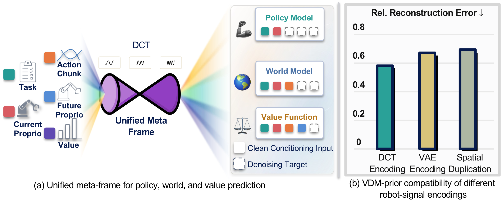
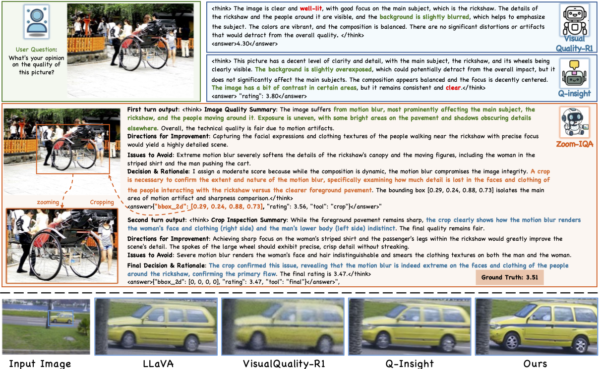
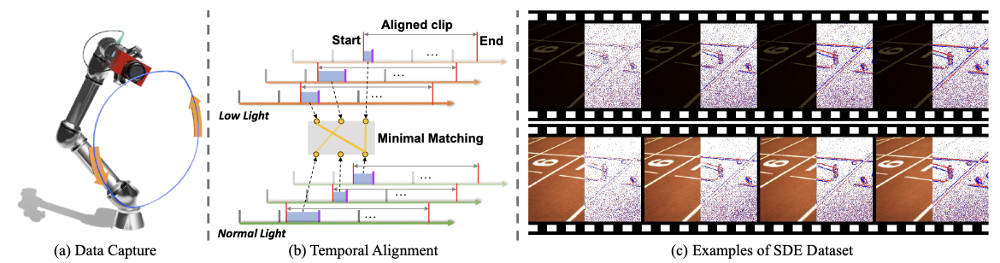

## About Me

I am currently a PhD student at <a href="https://sites.google.com/view/showlab" target="_blank">Show@NUS</a>, National University of Singapore, advised by Prof. <a href="https://scholar.google.com/citations?user=h1-3lSoAAAAJ&hl" target="_blank">Mike Z. SHOU</a>.

Before that, I was a research associate at <a href="https://www.mmlab-ntu.com/" target="_blank">MMLab@NTU</a>, Nanyang Technological University, Singapore, advised by Prof. <a href="https://www.mmlab-ntu.com/person/ccloy/" target="_blank">Chen Change Loy</a>. I earned my MPhil degree in 2024 under the supervision of Prof. <a href="https://scholar.google.com.hk/citations?hl=zh-CN&user=SReb2csAAAAJ" target="_blank">Lin Wang</a> at The Hong Kong University of Science and Technology. I completed my bachelor's degree at the Harbin Institute of Technology (Shenzhen) in 2022.

My current research focuses on **visual generation** and **embodied AI** — building models that can perceive, evaluate, and act in the physical world. My earlier work centers on event-based vision and computational imaging, with a focus on challenges such as HDR, low-light enhancement, deblurring, frame interpolation, rolling shutter correction, and super-resolution.

---

## 📣 News
<ul class="news-list">
  <li><strong>[Sep. 2026]</strong> 🎉 Our paper "From Video Frames to Robot Meta-Frames: A Unified Latent Interface for World Action Models" has been accepted to <strong>CoRL 2026</strong>!</li>
  <li><strong>[Jun. 2026]</strong> 🎉 Our paper "Zoom-IQA: Image Quality Assessment with Reliable Region-Aware Reasoning" has been accepted to <strong>ECCV 2026</strong>!</li>
  <li><strong>[Jan. 2026]</strong> 🚀 Started my PhD at Show Lab, National University of Singapore.</li>
  <li><strong>[Sep. 2025]</strong> 🎉 Our paper "Evlight++: Low-light video enhancement with an event camera: A large-scale real-world dataset, novel method, and more" has been accepted to <strong>IEEE TPAMI</strong>!</li>
  <li><strong>[Sep. 2025]</strong> 🎉 Our paper "Event-Guided Consistent Video Enhancement with Modality-Adaptive Diffusion Pipeline" has been accepted to <strong>NeurIPS 2025</strong>!</li>
  <li><strong>[Aug. 2025]</strong> 🎉 Our paper "AuthFace: Towards Authentic Blind Face Restoration with Face-oriented Generative Diffusion Prior" has been accepted to <strong>ACM MM 2025</strong> as an <strong>Oral</strong> presentation!</li>
  <li><strong>[May  2025]</strong> 🎉 Our paper "Self-supervised learning of event-guided video frame interpolation for rolling shutter frames" has been accepted to <strong>IEEE TVCG</strong>!</li>
  <li><strong>[Dec. 2024]</strong> 🚀 Started as a Research Associate at MMLab@NTU, Singapore.</li>
  <li><strong>[Jul. 2024]</strong> 🎉 Our work "UniINR: Event-guided Unified Rolling Shutter Correction, Deblurring, and Interpolation" was accepted by <strong>ECCV 2024</strong>.</li>
  <li><strong>[Apr. 2024]</strong> 🎉 Our work "Towards Robust Event-guided Low-Light Image Enhancement: A Large-Scale Real-World Event-Image Dataset and Novel Approach" was accepted by <strong>CVPR 2024</strong> for an <strong>Oral (.78%)</strong> presentation.</li>
</ul>

---

## 🧩 Selected Works

  <a class="work-card" href="https://github.com/EthanLiang99/MetaWAM" target="_blank" rel="noopener">
    
    

      
MetaWAM

      
CoRL 2026

    

  </a>
  <a class="work-card" href="https://ethanliang99.github.io/ZOOMIQA-Projectpage" target="_blank" rel="noopener">
    
    

      
Zoom-IQA

      
ECCV 2026

    

  </a>
  <a class="work-card" href="https://arxiv.org/pdf/2410.09864" target="_blank" rel="noopener">
    
    

      
AuthFace

      
ACM MM 2025 Oral

    

  </a>
  <a class="work-card" href="https://arxiv.org/pdf/2404.00834" target="_blank" rel="noopener">
    
    

      
EvLight

      
CVPR 2024 Oral

    

  </a>
  <a class="work-card" href="https://arxiv.org/abs/2408.16254" target="_blank" rel="noopener">
    
    

      
EvLight++

      
IEEE TPAMI

    

  </a>
  <a class="work-card" href="https://arxiv.org/pdf/2306.15507" target="_blank" rel="noopener">
    
    

      
EvRSVFI

      
IEEE TVCG

    

  </a>
  <a class="work-card" href="https://arxiv.org/pdf/2305.15078" target="_blank" rel="noopener">
    
    

      
UniINR

      
ECCV 2024

    

  </a>

---

## 🗒 Publications

  

    
 
CoRL 2026

      
    

  

  

[From Video Frames to Robot Meta-Frames: A Unified Latent Interface for World Action Models](https://github.com/EthanLiang99/MetaWAM)

**Guoqiang Liang**, et al.

[💻 Code](https://github.com/EthanLiang99/MetaWAM)

  

    
 
ECCV 2026

      
    

  

  

[Zoom-IQA: Image Quality Assessment with Reliable Region-Aware Reasoning](https://arxiv.org/abs/2601.02918)

**Guoqiang Liang**, Jianyi Wang, Zhonghua Wu, Shangchen Zhou, Chen Change Loy

[🛜 Project Page](https://ethanliang99.github.io/ZOOMIQA-Projectpage) [📄 arXiv](https://arxiv.org/abs/2601.02918)

  

    
 
ACM MM 2025 Oral

      
    

  

  

[AuthFace: Towards Authentic Blind Face Restoration with Face-oriented Generative Diffusion Prior](https://arxiv.org/pdf/2410.09864) 

**Guoqiang Liang**, Qingnan Fan, Bingtao Fu, Jinwei Chen, Hong Gu, Lin Wang

[💻 Code](https://github.com/EthanLiang99/AuthFace) [💿 Dataset](https://drive.google.com/file/d/16z0TX_Nomq2lDUimBXd5I_YLkeZwLhvL/view)

<!-- <strong></strong> -->
<!-- - Lorem ipsum dolor sit amet, consectetur adipiscing elit. Vivamus ornare aliquet ipsum, ac tempus justo dapibus sit amet.  -->

  

    
 
CVPR 2024 Oral

      
    

  

  

[Towards Robust Event-guided Low-Light Image Enhancement: A Large-Scale Real-World Event-Image Dataset and Novel Approach ](https://arxiv.org/pdf/2404.00834) 

**Guoqiang Liang**, Kanghao Chen, Hangyu Li, Yunfan LU, Lin Wang

[💻 Code](https://github.com/EthanLiang99/EvLight) [💿 Dataset](https://hkustgz-my.sharepoint.com/:f:/g/personal/gliang041_connect_hkust-gz_edu_cn/Ep_8Acz6cd1GjwtmEjAG0w8BkQsBWDjyHf9_56XSLTNLSw) [🛜 Project Page](https://vlislab22.github.io/eg-lowlight/)
<!-- <strong></strong> -->
<!-- - Lorem ipsum dolor sit amet, consectetur adipiscing elit. Vivamus ornare aliquet ipsum, ac tempus justo dapibus sit amet.  -->

  

    
 
IEEE TPAMI

      
    

  

  

[EvLight++: Low-Light Video Enhancement with an Event Camera: A Large-Scale Real-World Dataset, Novel Method, and More](https://arxiv.org/abs/2408.16254) 

Kanghao Chen, **Guoqiang Liang (co-first)**, Yunfan Lu, Hangyu Li, Lin Wang.
<!-- <strong></strong> -->
<!-- - Lorem ipsum dolor sit amet, consectetur adipiscing elit. Vivamus ornare aliquet ipsum, ac tempus justo dapibus sit amet.  -->

  

    
 
IEEE TVCG

      
    

  

  

[Self-supervised Learning of Event-guided Video Frame Interpolation for Rolling Shutter Frames](https://arxiv.org/pdf/2306.15507) 

Yunfan Lu, **Guoqiang Liang (co-fisrt)**, Lin Wang

[💻 Code](https://github.com/yunfanLu/Self-EvRSVFI)

<!-- <strong></strong> -->
<!-- - Lorem ipsum dolor sit amet, consectetur adipiscing elit. Vivamus ornare aliquet ipsum, ac tempus justo dapibus sit amet.  -->

  

    
 
ECCV 2024

      
    

  

  

[UniINR: Unifying Spatial-Temporal INR for RS Video Correction, Deblur, and Interpolation with an Event Camera](https://arxiv.org/pdf/2305.15078) 

Yunfan Lu, **Guoqiang Liang**, Yusheng Wang, Lin Wang, Hui Xiong

[💻 Code](https://github.com/yunfanLu/UniINR) [📺 Demo Video](https://youtu.be/Zfx9jBkSZmg)
<!-- <strong></strong> -->
<!-- - Lorem ipsum dolor sit amet, consectetur adipiscing elit. Vivamus ornare aliquet ipsum, ac tempus justo dapibus sit amet.  -->

---

## 💼 Internships and Working Experiences

<ul class="exp-list">
  <li>
    Jan. 2026 – Present · Singapore
    Show Lab, NUS
    PhD student, advised by Prof. <a href="https://scholar.google.com/citations?user=h1-3lSoAAAAJ&hl" target="_blank">Mike Z. SHOU</a>.
  </li>
  <li>
    Dec. 2024 – Dec. 2025 · Singapore
    MMLab, NTU
    Working with Dr. <a href="https://iceclear.github.io" target="_blank">Jianyi Wang</a>, Prof. <a href="https://shangchenzhou.com" target="_blank">Shangchen Zhou</a>, and Prof. <a href="https://www.mmlab-ntu.com/person/ccloy/" target="_blank">Chen Change Loy</a>.
  </li>
  <li>
    Jun. 2024 – Oct. 2024 · Shenzhen
    OPPO
    Working with Dr. <a href="https://scholar.google.com.sg/citations?user=REWxLZsAAAAJ&hl" target="_blank">Jie Liang</a> and Prof. <a href="https://www4.comp.polyu.edu.hk/~cslzhang/" target="_blank">Lei Zhang</a>.
  </li>
  <li>
    Jan. 2024 – May. 2024 · Hangzhou
    VIVO
    Working with Dr. <a href="https://fqnchina.github.io" target="_blank">Qingnan Fan</a>.
  </li>
  <li>
    Feb. 2022 – Aug. 2022 · Shenzhen
    APPLE
    MDE Intern of iPhone Housing Team @ IPEG, FOXCONN (iPhone 14/14pro project).
  </li>
</ul>

