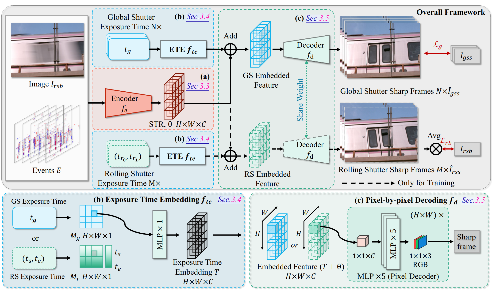
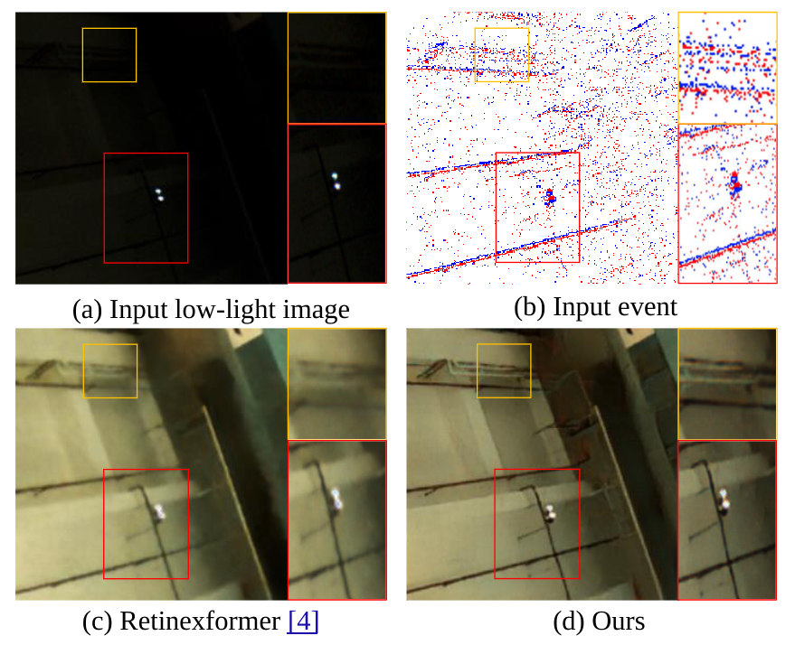
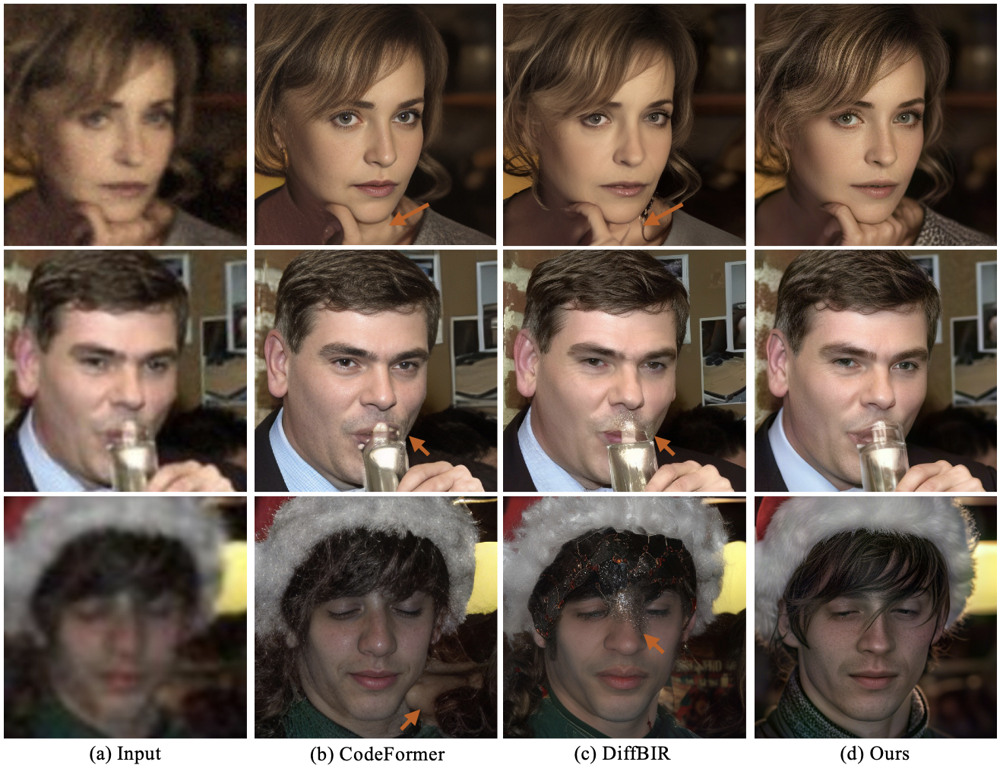
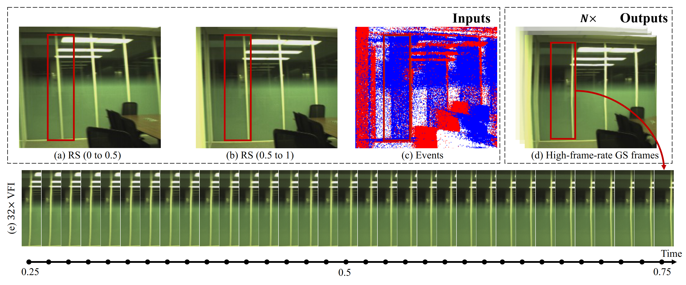
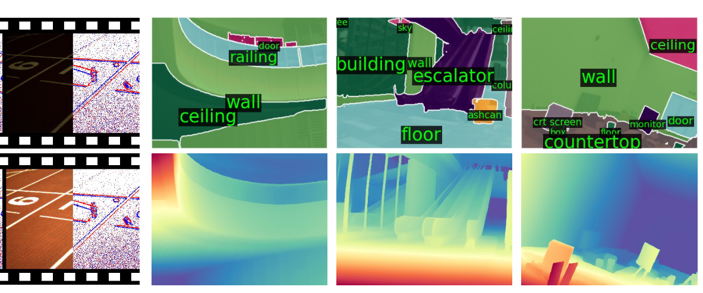

## About Me

I am currently a research associate at <a href="https://www.mmlab-ntu.com/" target="_blank">MMLab@NTU</a>, Nanyang Technological University, Singapore, advised by Prof. <a href="https://www.mmlab-ntu.com/person/ccloy/" target="_blank">Chen Change Loy</a>.

Before that, I earned my MPhil degree in 2024 under the supervision of Prof. <a href="https://scholar.google.com.hk/citations?hl=zh-CN&user=SReb2csAAAAJ" target="_blank">Lin Wang</a> at The Hong Kong University of Science and Technology, Guangzhou campus. I completed my bachelor's degree at the Harbin Institute of Technology (Shenzhen) in 2022.

My research centers on event-based vision and computational imaging, with a focus on challenges, e.g., HDR, low-light enhancement, deblurring, frame interpolation, rolling shutter correction, and super-resolution. 

---

## 🗒 Publications 

  

    
 
ECCV 2024

      
    

  

  

    

[UniINR: Unifying Spatial-Temporal INR for RS Video Correction, Deblur, and Interpolation with an Event Camera](https://arxiv.org/pdf/2305.15078) 

Yunfan Lu, **Guoqiang Liang**, Yusheng Wang, Lin Wang, Hui Xiong

💻[**Code**](https://github.com/yunfanLu/UniINR) | 📺[**Demo Video**](https://youtu.be/Zfx9jBkSZmg)

CVPR 2024 Oral

[Towards Robust Event-guided Low-Light Image Enhancement: A Large-Scale Real-World Event-Image Dataset and Novel Approach ](https://arxiv.org/pdf/2404.00834) 

**Guoqiang Liang**, Kanghao Chen, Hangyu Li, Yunfan LU, Lin Wang

💻[**Code**](https://github.com/EthanLiang99/EvLight) | 💿[**Dataset**](https://hkustgz-my.sharepoint.com/:f:/g/personal/gliang041_connect_hkust-gz_edu_cn/Ep_8Acz6cd1GjwtmEjAG0w8BkQsBWDjyHf9_56XSLTNLSw)
<!-- <strong></strong> -->
<!-- - Lorem ipsum dolor sit amet, consectetur adipiscing elit. Vivamus ornare aliquet ipsum, ac tempus justo dapibus sit amet.  -->

Under Review

[AuthFace: Towards Authentic Blind Face Restoration with Face-oriented Generative Diffusion Prior](https://arxiv.org/pdf/2404.00834) 

**Guoqiang Liang**, Qingnan Fan, Bingtao Fu, Jinwei Chen, Hong Gu, Lin Wang

<!-- <strong></strong> -->
<!-- - Lorem ipsum dolor sit amet, consectetur adipiscing elit. Vivamus ornare aliquet ipsum, ac tempus justo dapibus sit amet.  -->

Under Review

[Self-supervised Learning of Event-guided Video Frame Interpolation for Rolling Shutter Frames](https://arxiv.org/pdf/2306.15507) 

Yunfan Lu, **Guoqiang Liang (co-fisrt)**, Lin Wang

💻[**Code**](https://github.com/yunfanLu/Self-EvRSVFI) 

<!-- <strong></strong> -->
<!-- - Lorem ipsum dolor sit amet, consectetur adipiscing elit. Vivamus ornare aliquet ipsum, ac tempus justo dapibus sit amet.  -->

Under Review

[EvLight++: Low-Light Video Enhancement with an Event Camera: A Large-Scale Real-World Dataset, Novel Method, and More](https://arxiv.org/abs/2408.16254) 

Kanghao Chen, **Guoqiang Liang (co-first)**, Hangyu Li, Yunfan Lu, Lin Wang.

<!-- <strong></strong> -->
<!-- - Lorem ipsum dolor sit amet, consectetur adipiscing elit. Vivamus ornare aliquet ipsum, ac tempus justo dapibus sit amet.  -->

---

## Internships and Working Experiences
- **[Feb. 2022 ‑ Aug. 2022]**, Shenzhen, APPLE
  - MDE Intern of iPhone Housing Team @ IPEG, FOXCONN (iPhone 14/14pro project)
- **[Jan. 2024 ‑ May. 2024]**, Hangzhou, VIVO
  - Working with Dr. <a href="https://fqnchina.github.io" target="_blank">Qingnan Fan</a>
- **[Jun. 2024 ‑ Oct. 2024]**, Shenzhen, OPPO
  - Working with Dr. <a href="https://scholar.google.com.sg/citations?user=REWxLZsAAAAJ&hl" target="_blank">Jie Liang</a> and Prof. <a href="https://www4.comp.polyu.edu.hk/~cslzhang/" target="_blank">Lei Zhang</a>

---

